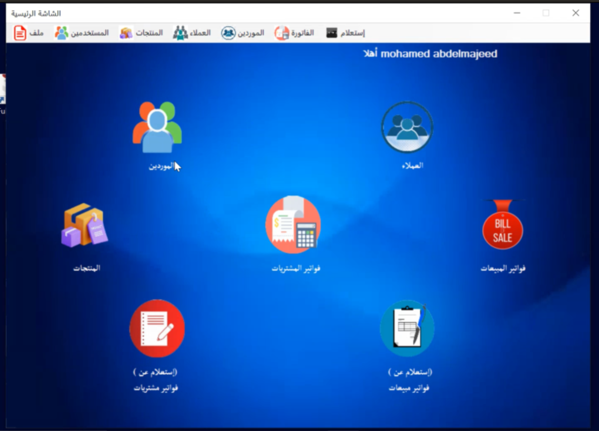
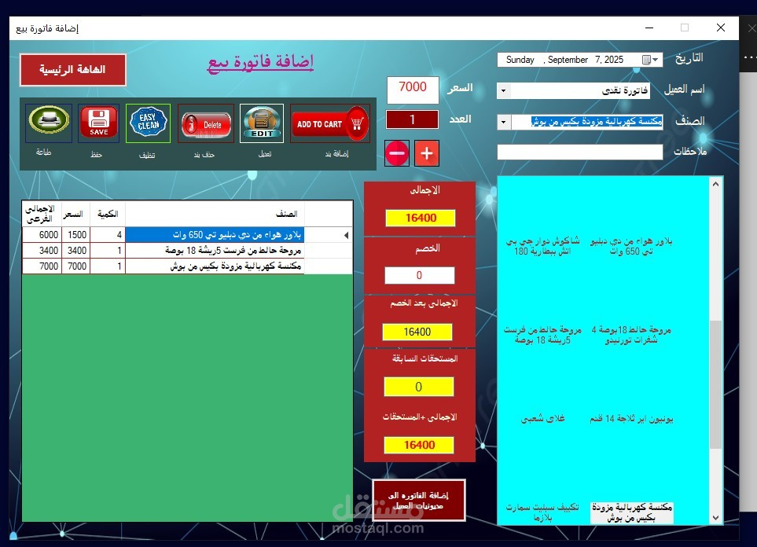

# 📱 Sales App - Desktop Store Management System

An advanced desktop application for managing **retail stores and warehouses** completely, providing a comprehensive solution for monitoring sales and purchases, managing inventory, customers, suppliers, and invoices.

---

## 📋 Documentation Contents

1. [Project Overview](#project-overview)
2. [Project Structure](#project-structure)
3. [Technologies Used](#technologies-used)
4. [Features and Options](#features-and-options)
5. [How Invoices Work](#how-invoices-work)
6. [Video Tutorial](#video-tutorial)
7. [User Interface Screenshots](#user-interface-screenshots)

---

## 🎯 Project Overview

**Sales App** is a comprehensive system for managing sales and purchases designed to:

- ✅ **Invoice Management**: Create and print sales and purchase invoices
- ✅ **Product Management**: Add and modify prices and quantities
- ✅ **Customer & Supplier Management**: Track debts and accounts
- ✅ **Security System**: User login and authentication
- ✅ **Detailed Reports**: Display sales statistics and profits
- ✅ **Category Management**: Organize products by categories

---

## 🏗️ Project Structure

```
SelesApp/
├── 📂 DB/                          ← Database Layer (Entity Framework)
│   ├── Model1.edmx                 ← Entity Framework Model
│   ├── AllProduct.cs               ← Products Table
│   ├── Category.cs                 ← Categories Table
│   ├── Customer.cs                 ← Customers Table
│   ├── CustomerDebt.cs             ← Customer Debts
│   ├── Suppler.cs                  ← Suppliers Table
│   ├── SupplerDebt.cs              ← Supplier Debts
│   ├── SelesBill.cs                ← Sales Invoices (Header)
│   ├── SelesBillDetail.cs          ← Sales Invoice Details (Items)
│   ├── PurchBill.cs                ← Purchase Invoices (Header)
│   ├── PurchBillDetail.cs          ← Purchase Invoice Details (Items)
│   ├── User.cs                     ← Users Table
│   └── Setting.cs                  ← General Settings
│
├── 📂 Screens/                     ← User Interface (Windows Forms)
│   ├── FrmLogin.cs                 ← Login Screen
│   ├── FrmStart.cs                 ← Startup Screen
│   ├── FrmMainForm.cs              ← Main Menu
│   ├── FrmAddNewUser.cs            ← Add New User
│   ├── FrmListAllUsers.cs          ← Users List
│   ├── FrmAddProduct.cs            ← Add Product
│   ├── FrmListProducts.cs          ← Products List
│   ├── FrmCustomer.cs              ← Customers Management
│   ├── FrmSuppliers.cs             ← Suppliers Management
│   ├── FrmSelesBay.cs              ← Create Sales Invoice
│   ├── FrmListBill.cs              ← Sales Invoices List
│   ├── FrmPyrchBill.cs             ← Create Purchase Invoice
│   ├── FrmListBillPurch.cs         ← Purchase Invoices List
│   ├── FrmReports.cs               ← Reports & Statistics
│   ├── FrmVerification.cs          ← Account Verification
│   └── *.Designer.cs & *.resx      ← Design Files & Resources
│
├── 📂 Properties/                  ← Project Properties
│   └── AssemblyInfo.cs             ← Assembly Information
│
├── 📂 Resources/                   ← Resources (Images & Icons)
│
├── 📂 bin/                         ← Build Output Files
├── 📂 obj/                         ← Temporary Object Files
│
├── App.config                      ← Application Settings File
├── Program.cs                      ← Application Entry Point
├── SelesApp.csproj                 ← Project File
└── packages.config                 ← NuGet Packages
```

---

## 💻 Technologies Used

| Technology | Description |
|-----------|-------------|
| **C# (.NET Framework 4.8)** | Primary Programming Language |
| **Windows Forms** | Graphical User Interface (UI) |
| **Entity Framework** | Database Access (ORM) |
| **SQL Server** | Database |
| **DevExpress v24.2** | Advanced UI Components (Grids, Reports, Printing) |
| **ADO.NET** | Database Connection Layer |

---

## 🎨 Features and Options

### 1️⃣ **Login System** (FrmLogin)
```
✓ Secure user login
✓ Username and password authentication
✓ Database validation
✓ Safe retry mechanism
```

### 2️⃣ **User Management**
- ➕ Add new user (FrmAddNewUser)
- 📋 View users list (FrmListAllUsers)
- ✏️ Edit user information
- 🗑️ Delete user from system

### 3️⃣ **Product Management**
- ➕ Add new product with:
  - Product name
  - Price
  - Available quantity
  - Category
  - Description
- 📋 View all products with search and filtering
- ✏️ Modify product price and description
- 🗑️ Remove product from system

### 4️⃣ **Category Management**
- Organize products under different categories
- Facilitate search and filtering
- Manage existing categories

### 5️⃣ **Customer Management**
- ➕ Add new customer with:
  - Customer name
  - Phone number
  - Address
  - Email
- 📊 Track customer debts
- 💰 Monitor payments and balances
- 📋 Complete customer list

### 6️⃣ **Supplier Management**
- ➕ Add new supplier (open account)
- 📊 Track supplier debts
- 💰 Record payments
- 📋 Suppliers registry

### 7️⃣ **Sales Invoice System**
- ➕ Create new sales invoice
- 📝 Add items (products) to invoice
- 🧮 Calculate total, discounts, and taxes
- 💳 Select customer and payment method (Cash/Credit)
- 🖨️ Print invoice directly
- 📊 View previous sales invoices (FrmListBill)

### 8️⃣ **Purchase Invoice System**
- ➕ Create purchase invoice from supplier
- 📝 Add purchased products
- 🧮 Calculate totals
- 💳 Record payment method
- 🖨️ Print purchase invoice
- 📊 View purchase history (FrmListBillPurch)

### 9️⃣ **Reports & Statistics**
- 📊 Daily/Monthly/Annual sales reports
- 💹 Total profits and losses
- 📈 Best-selling products
- 💰 Debt and liquidity reports
- 🔍 Search by date range

### 🔟 **Verification & Review** (FrmVerification)
- Check account balances
- Review invoice and inventory matching
- Verification and compliance reports

---

## 🧾 How Invoices Work (Detailed)

### 📋 **Sales Invoice:**

```
1. Open (FrmSelesBay)
   ↓
2. Select customer from list
   ↓
3. Enter invoice date
   ↓
4. Add items:
   - Select product
   - Enter quantity sold
   - Price calculated automatically (Price × Quantity)
   ↓
5. Automatic calculations:
   - Subtotal (sum of all items)
   - Apply discount (if any)
   - Tax (optional)
   - Final total
   ↓
6. Select payment method:
   - Cash (paid immediately)
   - Credit (debt registered)
   ↓
7. Print invoice with:
   - Store information
   - Customer details
   - Items table (products)
   - Total, tax, and discount
   - Manager signature
   ↓
8. Save to database:
   - SelesBill table: Invoice header data
   - SelesBillDetail table: Product details
   - Update CustomerDebt: If on credit
   - Update AllProduct: Stock quantities
```

### 💳 **Purchase Invoice:**

```
1. Open (FrmPyrchBill)
   ↓
2. Select supplier
   ↓
3. Enter invoice date
   ↓
4. Add purchased products:
   - Product
   - Quantity
   - New price (updated if changed)
   ↓
5. Calculate totals
   ↓
6. Select payment method:
   - Cash
   - Credit (register supplier debt)
   ↓
7. Print purchase invoice
   ↓
8. Update database:
   - Save to PurchBill & PurchBillDetail
   - Update SupplerDebt
   - Update inventory quantities
```

### 🖨️ **Invoice Printing:**

Using **DevExpress** library for advanced printing:
- Professional invoice design
- Optional QR codes
- PDF file generation
- Direct printer output
- Print preview

---

## 🎥 Video Tutorial

### 🎬 runSalesAPP - Complete Guide

This video demonstrates:
- ✅ Application installation and setup
- ✅ User login process
- ✅ Creating complete sales invoice
- ✅ Printing invoices
- ✅ Viewing reports
- ✅ Managing products and customers

**Video Download:**

[📥 Download runSalesAPP.mp4](runSalesAPP.mp4)

**Video Details:**
- File: `runSalesAPP.mp4`
- Located in the project root directory
- Full demonstration of all application features

---

## 📸 User Interface Screenshots

### Screenshot 1: Login Screen


**Description:** User authentication interface with username and password fields

---

### Screenshot 2: Main Form & Invoice Creation


**Description:** Main application interface with invoice creation and management features

---

## 🔧 Requirements & Installation

### Minimum Requirements:
- Windows 7 or later
- .NET Framework 4.8
- SQL Server 2012 or later
- 500 MB free space

### Installation Steps:
1. Clone project from GitHub
2. Open `SelesApp.sln` in Visual Studio
3. Restore NuGet packages
4. Update connection string in `App.config`
5. Run database updates
6. Build and run the project

---

## 👨‍💻 Team & Contributors

An educational project from **ITI** (Information Technology Institute) program.

---

## 📄 License

All Rights Reserved © 2025
